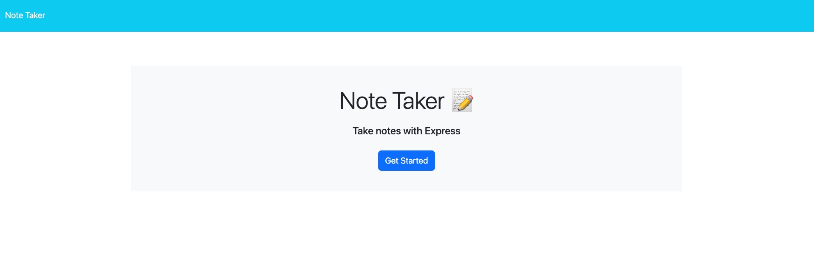
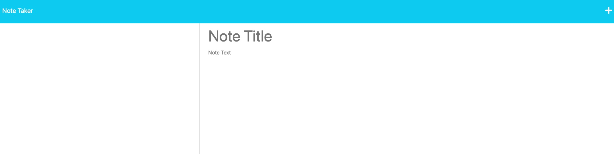

# Note Taker Starter Code

## The Module 11 Challenge is to create an application called Note Taker that can be used to write and save notes. This application will use an Express.js back end and will save and retrieve note data from a JSON file.

This project came with starter code with a pre-built front end and the goal of the homework was to build the back end, connect the two, and then deploy the entire application to Heroku.

## Table of Contents

- [Installation](#installation)
- [Usage](#usage)
- [Credits](#credits)
- [License](#license)

## Installation

Clone the repository to your machine in a new Github repo. Copy all the files and get crackin!

## Usage

This page can be used to keep and track notes similar to the notes app we know in Apple devices. It has a home landing page that introduces the app.

From there it goes to the page for creating notes. On this page, there are stored notes from previous entries as well as a space to add new notes

## Credits

Many thanks to my bootcamp teachers for helping me out with this!

## License

MIT
